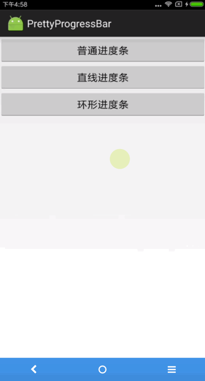

# PrettyProgressBar
This library provides three different kinds of progressbar for you! It's very simple to use it!

# 效果展示

# 使用示例
1. 引入依赖

    在项目根目录的build.gradle添加如下代码：

        allprojects {
            repositories {
                ...  //other repository
                maven { url 'https://jitpack.io' }
            }
        }
    }

    在app的build.gradle添加如下代码：

        dependencies {
    	            implementation 'com.github.yuanchaowhut:PrettyProgressBar:v1.3'
    	}

2. 在Activity中的简单使用
   + 创建ProgressManager实例。目前支持3种进度条样式，默认一个参数的构造函数为普通进度条，2个参数的构造函数则用于创建指定样式的进度条。

         ProgressManager pm = ProgressManager.makeProgress(this);
         or
         ProgressManager pm = ProgressManager.makeProgress(this,ProgressManager.STYLE_COMMON);
         or
         progressManager = ProgressManager.makeProgress(this, ProgressManager.STYLE_RATIO_LINE);
         or
         progressManager = ProgressManager.makeProgress(this, ProgressManager.STYLE_RATIO_ROUND);
   + 显示或隐藏.

         //显示进度条
          pm.show();

          //解除进度条
          pm.dismiss();
     可以看到，我们的 ProgressBar 用起来非常方便，短短几行代码就可以搞定，简直是呼之则来，挥之则去，完全不用理会布局文件。

# 缺陷及不足
+ 本项目中，进度条依托的布局是 android.R.id.content，它是系统默认的一个 FrameLayout。所有Activity的布局文件都是默认包含它的，所以可以做到不必理会app中具体的布局文件。
+ 但是，由于时间精力有限，目前进度条样式比较单一，并且不够灵活，不支持自定义样式，后期有时间再进行完善。
+ 最后，由于个人水平有限，如果使用过程中出现bug，欢迎大家踊跃提出修改建议，交流QQ：928898858
